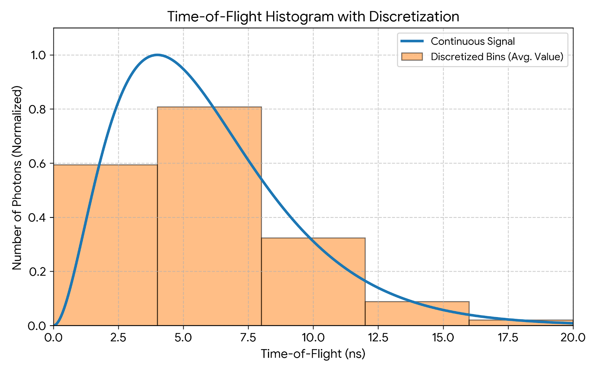
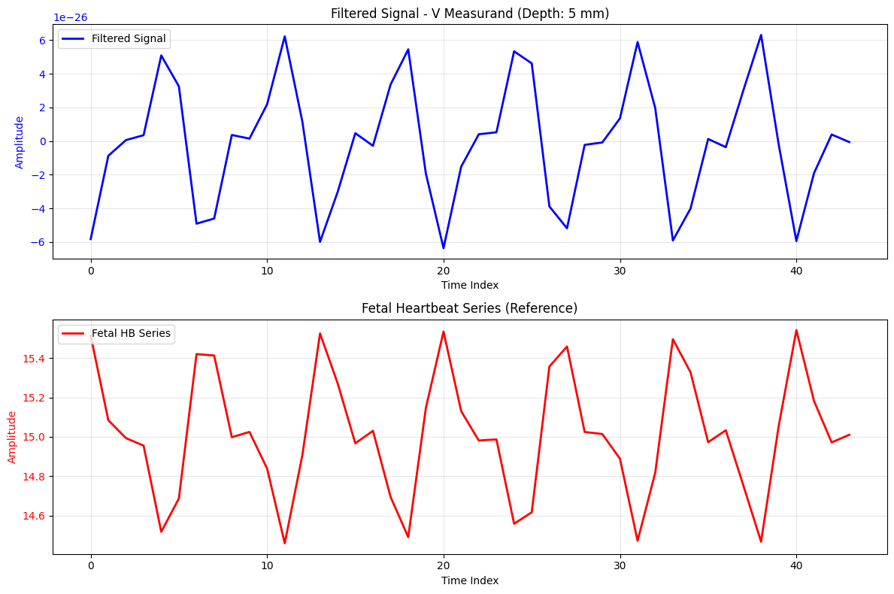

# Our Setup

*Fig: Our simulation process flow*
Here is our current optimization process:

1. We use Monte-Carlo to simulate photon arrival time(T) for 1e8 photons and compute a Distribution of Time-of-Flight (DTOF) curve. We repeat the same multiple times to simulate pulsation. We alter the Fetal & Maternal Layer absorption coefficient, $\mu_{a,fetal}(t)$ and $\mu_{a,mom}(t)$, for each pulsation. We generate a single DTOF for each time point, t.
2. DTOF's x-axis (T) is discretized into $M=20$ bins.
3. We perform a point-wise multiplication of the discretized DTOF with a "window" vector. The elements within the window vector can have any values
4. We feed the product to a Compact Statistics generator to convert each DTOF into a single number - generating a time series across all DTOFs ($\alpha(t)$).
5. Compact Statistics include :
   1. Sum
   2. Mean Photon Arrival Time, $\bar{T}$
   3. Photon Arrival Time Variance, $Var(T)$
6. We iteratively optimize the window based on some Figure of Merit computed on $\alpha(t)$. The optimized window is "free-from" - its elements can have any positive weight.

*Fig: Sample image of Distribution of Time-of-Flight, both the continuous and discrete(binned) versions*

# Motivations for Compact Stats

1. Sum is the typical one - essentially reduces down to Continuous Wave (CW)
2. $\bar{T}$ has better depth selectivity. Depth selectivity is the ability to prioritize deeper-tissue signals over shallow layer interference. Defined as the ratio between deep-tissue Sensitivity to shallow-tissue sensitivity.
3. $Var(T)$ has the best depth selectivity among the three

*Fig: We show the simulated $\alpha(t)$ using $Var(T)$ as the compact stats along with the underlying $\mu_{a,fetal}(t)$ used for generating the DTOF sets. This uses our optimized window. Note the near perfect negative correlation*

# Issues

1. *Window Shape:* Our current optimization creates a discrete, free-form window. Which does not align with the current hardware.
2. *Runaway Optimization:* For both $\bar{T}$ and $Var(T)$, the optimizer needs to compute $Var(T)$. However, if the window focuses all its weights on a single bin, computing $Var(T)$ is impossible. For example: If Our window = [0, 0, 1, 0, 0], there only one bin in the DTOF. In which case, the $\bar{T}$ equals to the value of that bin. and $Var(T) = 0$. This creates exploding gradients and breaks the optimization process. This can be solved by either imposing a shape constraint on the window or by storing additional information to compute true, non-discretized compact statistics. (The second method would involve working with 3x more numbers, which is still many order magnitude less than working the entire continuous DTOF)

# Questions

1. From a practical stand point, does it make more sense to create a continuous window with a given shape or free-from, discrete(in T) window? 
2. Does it add any extra value to work with all three compact stats? Or should we just stick to Sum?